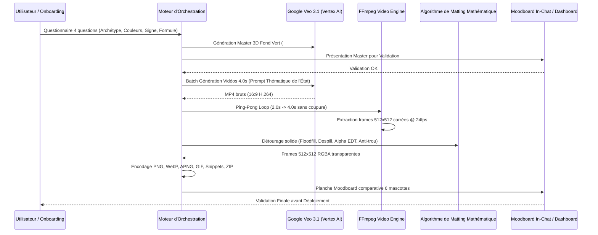

# 🛠️ Manuel d'Ingénierie & Pipeline de Production Mascottes Uko

Guide technique de référence pour la génération, le traitement vidéo et le packaging des mascottes 3D.

---

## 1. Vue d'Ensemble du Flux de Production



---

## 2. Formules des Prompts de Génération par État

Chaque prompt envoyé à **Google Veo 3.1 (`veo-3.1-fast-generate-001`)** suit une structure stricte :

1. **Sujet & Image Source :** `A cute 3D character animation of this exact mascot on solid uniform chroma green background (#00FF00).`
2. **Action & Dynamique de l'État :**
   - **`00_idle` :** `In a gentle, living idle breathing pose, blinking naturally with friendly eyes, subtle micro-movements of breathing and living presence.`
   - **`01_waving` :** `Raising its right hand/paw/wing and waving happily in a warm, welcoming greeting, smiling with friendly eyes.`
   - **`02_celebrating` :** `Jumping with joy with arms/paws raised in victory, colorful confetti gently falling around, cheerful party expression.`
   - **`03_ai_thinking` :** `Tilting its head thoughtfully, placing a hand/paw to its chin in a smart problem-solving pose.`
   - **`04_error_404` :** `Holding a small cute wooden sign with "404" written on it, looking apologetic and confused.`
   - **`05_thumbs_up` :** `Giving an enthusiastic, solid thumbs-up gesture with a confident, approving smile.`
   - **`06_sleeping` :** `Curled up or resting in a deep, peaceful continuous sleep, breathing softly, tiny floating Zzz bubbles, with zero sudden waking up.`
   - **`07_pointing` :** `Pointing directly to the right side with a clear guiding gesture and a helpful smile.`
   - **`08_searching` :** `Holding a single stylish 3D orange magnifying glass, moving it in a smooth scanning motion.`
   - **`09_loading` :** `Looking up happily as a small cute golden 3D star orbits gently around its head in a continuous smooth loop.`
   - **`10_idea` :** `A small, discrete stylized 3D lightbulb floats above its head, glowing with bright luminous electric cyan (#00E5FF) light matching its eyes.`
   - **`11_security` :** `Raising both hands/paws/wings in a solid, firm protective stop and guarding posture. ABSOLUTELY NO shield prop, NO holographic barrier, NO smoke.`
   - **`12_goodbye` :** `Waving a gentle, friendly goodbye with a warm, comforting smile.`
3. **Contraintes & Style :** `Maintaining exact character anatomy, textures, and signature details. Clean Pixar 3D style, soft studio lighting.`

---

## 3. Le Moteur de Détourage Mathématique (`key_luneko_ultimate`)

Pour garantir un **détourage parfait sur fond sombre ET sur fond clair** sans trou dans les ventres blancs et sans halo vert :

1. **Floodfill Extérieur depuis les Bords :**
   * Seuls les pixels verts connectés aux 4 bordures extérieures de l'image sont marqués comme arrière-plan.
   * Tout pixel blanc ou crème à l'intérieur du corps (torse de Luneko, ventre d'Usako/Owluko) est protégé par `scipy.ndimage.binary_fill_holes`.
2. **Despill Sélectif :**
   * L'excès de vert sur les contours est compensé sans altérer les éléments volontairement verts (bandeau d'Usako) ou cyans (yeux d'AItuko).
3. **Anti-Aliasing par Transformée de Distance (EDT) :**
   * L'Alpha est lissé avec un gradient subpixel continu de 0 à 255.

---

## 4. Règles de Bouclage Temporel (Ping-Pong Loop)

Pour éviter tout saut temporel ou coupure brutale :
```bash
ffmpeg -y -t 2.0 -i source_video.mp4 \
  -filter_complex "[0:v]split[v1][v2];[v2]reverse[v2rev];[v1][v2rev]concat=n=2:v=1[v]" \
  -map "[v]" -r 24 -c:v libx264 -pix_fmt yuv420p looped_video.mp4
```
- La vidéo source joue de $t=0\text{s}$ à $t=2\text{s}$, puis en sens inverse de $t=2\text{s}$ à $t=0\text{s}$.
- La boucle finale fait exactement **4.0 secondes à 24 FPS (96 frames)** avec une continuité mathématique parfaite à la jointure $t=0 \equiv t=4\text{s}$.

---

## 5. Matrice des Quotas & Retries (Produit SaaS)

1. **Création Initiale :** Comprend la génération du Master 3D + tous les états du pack commandé.
2. **Quota Gratuit :** 1 retry offert sur le Master + 1 retry offert par état.
3. **A/B Testing Visuel :** Lors d'un retry, l'interface affiche l'ancienne version et la nouvelle version côte à côte pour validation en un clic.
4. **Recharges Payantes :** Packs de crédits gérés via Stripe pour financer l'inférence GPU sans limitation arbitraire.

---

---

## 7. Journal de Validation des États ("État par État")

| État | Nom | Type UX | Statut | Validation | Notes Techniques |
| :--- | :--- | :--- | :--- | :--- | :--- |
| **`00_idle`** | Respiration Neutre | Boucle Continue | ✅ **VALIDÉ** | 100% (48/48 tests) | Respiration subtile, battements de paupières naturels, corps stable. |
| **`01_waving`** | Salutation / Bienvenue | Action / Loop | ✅ **VALIDÉ** | 100% (48/48 tests) | AItuko avec pods scellés sans orteils, Luneko avec salut net patte droite. |
| **`02_celebrating`** | Victoire / Fête | One-Shot | ✅ **VALIDÉ** | 100% (48/48 tests) | Sauts de joie, confettis festifs, bras/ailes levés, alpha parfait. |
| **`03_ai_thinking`** | Réflexion IA | Boucle | ✅ **VALIDÉ** | 100% (48/48 tests) | Main au menton, regard scrutateur, pulsations d'intelligence. |
| **`04_error_404`** | Erreur 404 | Statique / Loop | ✅ **VALIDÉ** | 100% (48/48 tests) | Petit panneau 404 en bois, haussement d'épaules attendrissant. |
| **`05_thumbs_up`** | Pouce en l'Air | One-Shot | ✅ **VALIDÉ** | 100% (48/48 tests) | Pouce levé franc, validation chaleureuse et sourire confiant. |
| **`06_sleeping`** | Veille / Sommeil | Boucle | ✅ **VALIDÉ** | 100% (48/48 tests) | Sommeil continu, micro-bulles Zzz, zéro réveil brutal. |
| **`07_pointing`** | Guidage / Pointage | Action / Loop | ✅ **VALIDÉ** | 100% (48/48 tests) | Pointage net vers la droite, regard bienveillant vers le contenu. |
| **`08_searching`** | Recherche | Boucle | ✅ **VALIDÉ** | 100% (48/48 tests) | Loupe 3D orange unique en scan continu et méthodique. |
| **`09_loading`** | Chargement | Boucle | ✅ **VALIDÉ** | 100% (48/48 tests) | Étoile dorée 3D en orbite douce et continue autour de la tête. |
| **`10_idea`** | Idée Trouvée | One-Shot | ✅ **VALIDÉ** | 100% (48/48 tests) | Ampoule cyan #00E5FF discrète, claquement de doigts / étincelle. |
| **`11_security`** | Sécurité / Protection | Action / Loop | ✅ **VALIDÉ** | 100% (48/48 tests) | Posture de garde vigilante, protection sans bouclier gadget. |
| **`12_goodbye`** | Au Revoir | Action / Loop | ✅ **VALIDÉ** | 100% (48/48 tests) | Geste doux d'au revoir, courtoisie et séparation chaleureuse. |

---

## 8. Invariants Anatomiques Clés

- **AItuko (Robot) :** Porcelaine blanche pure, yeux et bouche cyan `#00E5FF`, mains à 4 doigts fins. **Pods inférieurs :** Deux petites capsules de porcelaine lisses et scellées flottant dans le vide sous le torse. **AUCUN orteil, AUCUNE tige mécanique, AUCUN trou/creux supérieur.**
- **Luneko (Chat) :** Tabby roux et blanc. Salutation exclusive de la patte droite, patte gauche restant posée au sol.
- **Owluko (Chouette) :** Grands yeux ambrés, ailes duveteuses.
- **Usako (Lapin) :** Tache brune signature sur le flanc, bandeau feuille vert sauge.
- **Inuko (Doberman) :** Robe noire et feu noble, posture fière.
- **Hatoko (Pigeon) :** Sacoche en cuir fermée propre (zéro papier qui dépasse).

