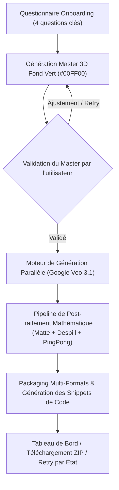

# 🏛️ Spécification Architecturale : Uko Mascot Builder Studio & Pipeline de Génération

Ce document définit l'architecture complète du moteur autonome de génération de mascottes pour l'outil SaaS utilisateur final ainsi que la méthodologie de production interne « État par État ».

---

## 1. Vision Produit : Le "Mascot Builder Studio" (SaaS)

L'objectif est de permettre à n'importe quel utilisateur ou entreprise de créer sa mascotte de marque 3D ultra-cohérente et prête à l'intégration web/mobile en répondant à un **questionnaire minimaliste et percutant**.



### 📝 Le Questionnaire Utilisateur Minimaliste (4 Questions Primordiales)

1. **Espèce / Archétype :** Quel type de mascotte souhaitez-vous ? (ex: *Robot futuriste, Chouette savante, Chat tigré, Lapin zen, Doberman protecteur, Pigeon messager*, ou saisie libre).
2. **Palette & Éléments Lumineux :** Quelles sont vos couleurs de marque et la couleur des yeux/lumières ? (ex: *Blanc porcelaine + Cyan #00E5FF, Roux crème + Yeux dorés*).
3. **Signe Distinctif / Marque de Fabrique :** Avez-vous un accessoire ou une particularité anatomique signature ? (ex: *Tache brune sur le flanc, sacoche en cuir fermée, bandeau vert sauge, petites mains 4 doigts*).
4. **Formule & Pack :** 
   - **Pack Essentiel (6 États) :** `00_idle`, `01_waving`, `02_celebrating`, `04_error_404`, `05_thumbs_up`, `12_goodbye`
   - **Pack Pro Complet (13 États) :** La suite intégrale de `00_idle` à `12_goodbye`.

---

## 2. Définition Technique d'un "État Clôturé" (Done Criteria)

Un état (ex: `00_idle`) n'est considéré comme **terminé et clos** que lorsque **l'ensemble des artefacts techniques suivants sont générés, testés et vérifiés** pour les 6 mascottes :

```
📁 assets/{etat_id}/
├── 🖼️ static.png          (512×512 PNG transparent avec canal Alpha subpixel)
├── ⚡ static.webp         (512×512 WebP transparent 92% qualité ultra-léger)
├── 🎬 animated.gif        (512×512 GIF transparent 24fps sans halo)
├── 🚀 animated.webp       (512×512 WebP animé 60fps haute performance)
├── 💎 animated.png        (512×512 APNG haute fidélité pour iOS/macOS)
├── 🎥 looped_video.mp4    (Vidéo H.264 bouclée ping-pong 24fps)
├── 💻 snippet.json        (Code d'intégration React / Vue / Web Component / Flutter)
└── 📦 download_bundle.zip (Archive zippée prête au téléchargement)
```

---

## 3. Matrice des 3 Catégories UX de Boucles Temporelles

| Catégorie UX | Définition UX | Règle de Bouclage (Loop Design) | États Assignés |
| :--- | :--- | :--- | :--- |
| **1. Ambiance (*Ambient*)** | Mascotte présente en permanence sur l'écran en attente. | Boucle infinie douce et symétrique (respiration $\pm 2.5\text{px}$, clignements subtils). | `00_idle`, `06_sleeping` |
| **2. Déclenchée (*One-Shot*)** | Réaction expressive à un événement utilisateur. | Part du repos $\rightarrow$ action expressive $\rightarrow$ retour fluide au repos. | `01_waving`, `02_celebrating`, `03_ai_thinking`, `04_error_404`, `05_thumbs_up`, `07_pointing`, `11_security`, `12_goodbye` |
| **3. Traitement (*Processing*)** | Signal visuel d'une opération système en cours. | Boucle cyclique rythmée continue (rotation d'étoile, balayage de loupe, pulsation d'ampoule). | `08_searching`, `09_loading`, `10_idea` |

---

## 4. Politique de Retry, Quotas & Monétisation (SaaS)

1. **Génération Initiale :** Le pack acheté donne droit à la génération complète du Master + des états du pack.
2. **Retry Gratuit Inclus :** 1 régénération gratuite offerte pour le Master, et 1 retry gratuit par état si l'utilisateur souhaite une variante.
3. **Retries Supplémentaires (Payants) :** Au-delà du quota gratuit, achat de crédits par lot (ex: 5 retries d'état pour 4,99 €) pour couvrir les coûts d'inférence GPU (Google Veo / Vertex AI).
4. **Sélecteur Comparatif (A/B Test) :** Lors d'un retry, l'utilisateur voit la version A et la version B côte à côte dans le moodboard et clique sur sa préférée pour l'adopter définitivement.
