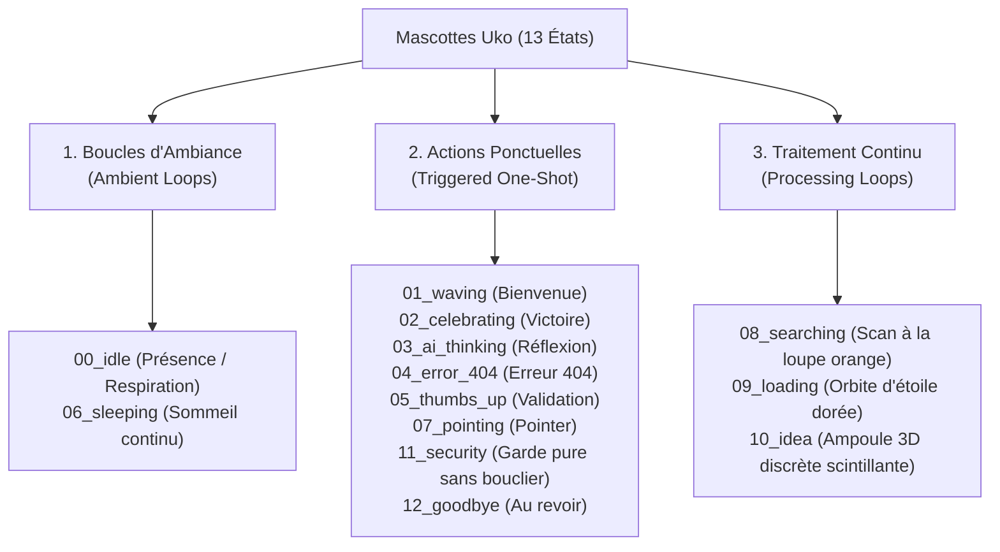

# 🌟 Uko Stickers & Mascot Design System

Système officiel de mascottes et stickers 3D animés pour applications web et mobiles modernes, propulsé par **Google Veo 3.1**, **Vertex AI** et un pipeline de traitement d'images mathématique avancé.

---

## 🎭 La Fratrie des 6 Mascottes Uko

| Mascotte | Nom | Espèce / Rôle | Signe Distinctif & Couleurs Clés |
| :--- | :--- | :--- | :--- |
| 🤖 | **AItuko** | Robot Porcelaine | Porcelaine blanche pure, yeux et sourire cyan électrique `#00E5FF`, mains 4 doigts délicates. |
| 🦉 | **Owluko** | Chouette Savante | Duvet crème moelleux, grands yeux dorés chaleureux, balancement doux. |
| 🐱 | **Luneko** | Chat Tabby Roux | Pelage roux tigré et blanc immaculé (sans trou), queue souple, posture féline sereine. |
| 🐰 | **Usako** | Lapin Zen | Fourrure blanche crème avec sa **tache brune signature** sur le flanc, bandeau vert sauge feuille. |
| 🐕 | **Inuko** | Doberman Protecteur | Robe noire et feu noble, posture assise fière, regard loyal et vigilant. |
| 🕊️ | **Hatoko** | Pigeon Voyageur | Plumage gris tourterelle doux, **sacoche en cuir fermée propre** avec fermoir doré. |

---

## 📊 Matrice des 13 États & Classification UX

Chaque état appartient strictement à l'une des **3 Catégories UX de Bouclage** :



---

## 🚀 Vision Produit : "Uko Mascot Builder Studio" (SaaS)

Outil permettant à tout créateur ou entreprise de générer sa propre mascotte de marque ultra-cohérente et prête au déploiement via un **questionnaire onboarding ultra-simplifié en 4 questions** :

1. **Archétype / Espèce :** Robot, Chouette, Chat, Lapin, Chien, Pigeon ou invite libre.
2. **Couleurs de Marque & Yeux :** Palette primaire + couleur d'accentuation lumineuse.
3. **Marque de Fabrique Signature :** Accessoire (sacoche, bandeau) ou particularité anatomique (tache brune, mains épurées).
4. **Formule :** Pack Essentiel (6 états clés) ou Pack Pro Intégral (13 états).

---

## 📦 Structure des Livrables par État (Definition of Done)

Chaque état pour chaque mascotte contient l'ensemble des 8 fichiers certifiés :

```
📁 assets/{state_id}/ (ou mascots/{mascot_name}/assets/{state_id}/)
├── 🖼️ static.png          # PNG 512×512 détouré avec canal Alpha subpixel
├── ⚡ static.webp         # WebP 512×512 transparent haute performance
├── 🎬 animated.gif        # GIF 512×512 animé transparent 24 FPS sans halo
├── 🚀 animated.webp       # WebP 512×512 animé 60 FPS ultra-léger
├── 💎 animated.png        # APNG haute fidélité pour écosystème Apple
├── 🎥 looped_video.mp4    # Vidéo MP4 H.264 bouclée ping-pong 24 FPS
├── 💻 snippet.json        # Composants prêts pour React, Vue, HTML, Flutter
└── 📦 bundle_{m}_{s}.zip  # Archive complète prête au téléchargement
```

---

## 💻 Intégration Rapide

### React / Next.js
```tsx
import React from 'react';

export const MascotSticker = ({ mascot = "aituko", state = "00_idle" }) => (
  <picture>
    <source srcSet={`/mascots/${mascot}/assets/${state}/animated.webp`} type="image/webp" />
    
  </picture>
);
```

### HTML Simple
```html
<picture>
  <source srcset="/mascots/owluko/assets/00_idle/animated.webp" type="image/webp">
  
</picture>
```
